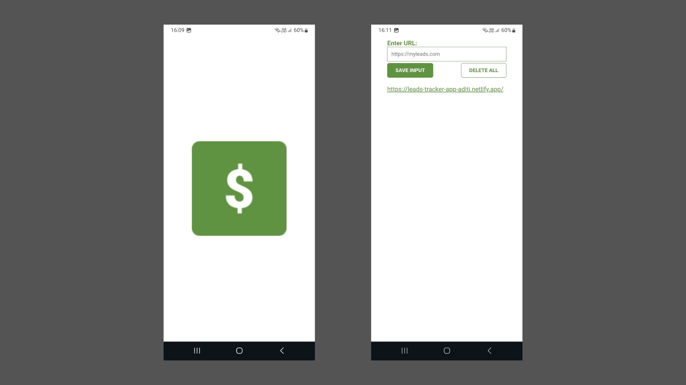

# 📱 Leads Tracker (Mobile App - PWA)

A simple and lightweight **Progressive Web App (PWA)** version of the **Leads Tracker** that helps you **save and manage leads/links** on your mobile device.  
This version uses **Firebase Realtime Database** for storing leads, so your data stays **synced across devices** in real-time.

## 🚀 Features
- Save input links manually  
- Cloud-based storage with Firebase Realtime Database
- Access your leads from any device (mobile/desktop)  
- Real-time synchronization across all devices  
- Delete all saved leads with double click  
- Add to home screen (via PWA manifest) for an app-like experience  
- Clean and mobile-friendly interface  

## 📸 Screenshot

## 📲 Installation (Add to Home Screen)
1. Open the app in your mobile browser (Chrome / Edge / Brave / etc.).  
2. Tap the **three-dot menu** (⋮) and select **"Add to Home screen"**.  
3. The Leads Tracker app will now appear as an icon on your device, just like a native app.  
4. Launch it directly from your home screen anytime.

## 🛠️ Tech Stack
- HTML, CSS, JavaScript 
- Web Application Manifest (PWA support)
- Firebase Realtime Database

## ⚙️Usage
- Type a link in the input box and click SAVE INPUT
- Double-click DELETE ALL to clear your saved leads
- Tap any saved lead to open it in a new tab
- All changes are synced instantly to Firebase
